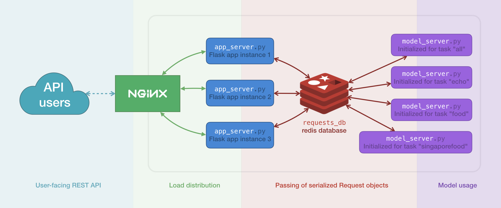
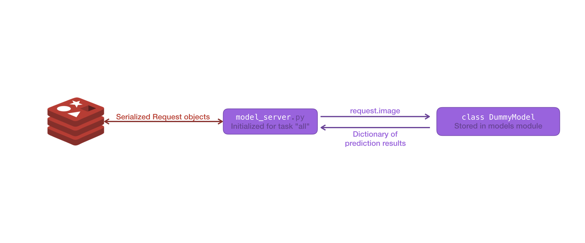

= restful-app
:toc:

This Flask app provides a RESTful API for users to send images into
machine learning models. Requests are limited by day.
Users must include an admin-issued token in their HTTP requests.

== Guide for API users
=== How to include your token in HTTP requests
There are 3 ways to include your token, according to your preference.

1. Include it as a URL querystring argument like in the three examples below.
This is not recommended, since URLs are often kept in log files.
Your token would be subjected to security risks.

    http://[hostname]/quota?token=YOUR_TOKEN_HERE

    http://[hostname]/echo?token=YOUR_TOKEN_HERE

    http://[hostname]/model?token=YOUR_TOKEN_HERE

2. Include your token in the `Authorization` header of your HTTP request.

 curl -H "Authorization:YOUR_TOKEN_HERE" http://[hostname]/quota

3. Include your token in the `Token` header of your HTTP request.

 curl -H "Token:YOUR_TOKEN_HERE" http://[hostname]/quota

=== How to check your remaining request quota
Use a HTTP GET request on `http://[hostname]/quota`.
You will receive a `200 OK` response with a JSON body just like the following:

    {
        "success": true,
        "quotas": {
            "quota_left": 42,
            "total_quota": 50
        }
    }

However, if your `quota_left` reaches zero, the response will be
`401 Unauthorized` with the following JSON instead.

    {
        "success": false,
        "error": "Unauthorized",
        "message": "No more usage quota.",
        "quotas": {
            "quota_left": 0,
            "total_quota": 50
        }
    }

=== How to make the server echo your image
This helps you to check if the server is receiving the image as you expect it to.

1. Prepare a HTTP `POST` request on `http://[hostname]/echo`.
2. Include your image in your HTTP request body.
3. Don't forget to include your token in the request.
4. You will receive a `200 OK` response with the same image, exactly as the server
received it, back in the HTTP response body.

=== How to make a model prediction request
Use a HTTP `POST` request on `http://[hostname]/model`.
You will receive a `200 OK` response with a JSON body just like the following:

    {
        "success": true,
        "quotas": {
            "quota_left": 42,
            "total_quota": 50
        },
        "results": {
            "cat": 0.95,
            "dog": 0.82,
            "fish": 0.35,
            "laksa": 0.3
        }
    }

For specific tasks, use a querystring argument such as `task=food` in `http://[hostname]/model?task=food`.
You will receive the results for this specific task instead.

    {
        "success": true,
        "quotas": {
            "quota_left": 42,
            "total_quota": 50
        },
        "results": {
            "bbq": 0.95,
            "laksa": 0.82,
            "ramen": 0.35,
            "laksa": 0.3
        }
    }

In case you're wondering, the default `model` endpoint is
equivalent to `/model?task=all`.

If your `quota_left` reaches zero, the response will be
`401 Unauthorized` with the following JSON, just like in `quota`.

    {
        "success": false,
        "error": "Unauthorized",
        "message": "No more usage quota.",
        "quotas": {
            "quota_left": 0,
            "total_quota": 50
        }
    }

== Admin operations
Admins manage the user database.

=== How to login as an admin
All admin requests require a HTTP Basic login with an admin's username and
password.

Some options for making HTTP requests with login information include the `curl` command, e.g.:

    curl -u admin0:somepassword1 http://0.0.0.0:5000/users

There also exist other apps such as *https://insomnia.rest/[Insomnia]*, that allow you
to save HTTP requests for convenience.

=== How to edit admin accounts
All admin information must be stored in the `admins.py` module's `get_password_hashes()` function.
In Docker, there are some file permission issues that crop up when using the typical `open()` function,
so instead of storing the admin password hashes in a separate JSON file, the hashes are stored
in the `admins.py` module in a dictionary.

    def get_password_hashes():
        return {
            "admin0": "password_hash_1",
            "admin1": "password_hash_2",
            "admin2": "password_hash_3",
            "admin3": "password_hash_3",
            ...
        }

Passwords themselves are not stored directly. Only their
*http://passlib.readthedocs.io/en/stable/lib/passlib.context.html#passlib.context.CryptContext.encrypt[PassLib-encrypted]*
hashes are stored.

To add and remove admin accounts, you can add your own admin username and
password hash directly to the dictionary. To generate a hash from your raw password:

1. Run `python admins.py`
2. Enter your admin password when prompted
3. Copy the new hash into the `admins.py` module's `get_password_hashes()` dictionary.

=== Summary of admin operations
This table is a summary of the operations available for admins.
Further elaboration is provided below the table.

|===
|Method |URI |JSON fields| Action

|`GET`
|`[hostname]/users`
|Not Applicable
|Retrieves a list of users

|`GET`
|`[hostname]/users/<string:name>`
|Not Applicable
|Retrieves a particular user's info

|`POST`
|`[hostname]/users/<string:name>`
|`name`, `token`, `total_quota`, `quota_left`
|Adds a user

|`PUT`
|`[hostname]/users/<string:name>`
|`name`, `token`, `total_quota`, `quota_left`
|Updates a user

|`DELETE`
|`[hostname]/users/<string:name>`
|Not Applicable
|Deletes a user
|===

=== Retrieving a list of all users
`GET` `http://[hostname]/users` returns a JSON similar to the following:

    {
        "success": true,
        "users": [
            {
                "name": "tom",
                "token": "13CA31",
                "quota_left": 0,
                "total_quota": 10
            },
            {
                "name": "rob",
                "token": "31FA56G4FA",
                "quota_left": 3,
                "total_quota": 10
            },
            {
                "name": "smith",
                "token": "48F65D",
                "quota_left": 51,
                "total_quota": 1000
            }
        ]
    }

=== Retrieving a single user by name
`GET` `http://[hostname]/users/[username]` returns a JSON similar to the following:

    {
        "success": true,
        "user": {
            "name": "tom",
            "token": "G12X6",
            "quota_left": 4,
            "total_quota": 10
        }
    }

=== Add a user
Call `POST` `http://[hostname]/users` but include a JSON in the body,
like that of the example below.

    {
        "name": "jaMeS ",                   # Compulsory string
        "token": " D3G34K1AD",              # Optional string; is generated if not specified
        "quota_left": 49,                   # Optional integer; set to 10 if not specified
        "total_quota": "50"                 # Optional integer; set to same as total_quota if not specified
    }

You will get back a JSON response with the info of the user you've successfully added.

    {
        "success": true,
        "user": {
            "name": "james",
            "token": "D3G34K1AD",
            "quota_left": 49,
            "total_quota": 50
        }
    }

Here's a summary of restrictions on the values of a new user's info:
|===
|Key |Value |Compulsory? | Must be unique? |Value if not specified

|`name`
|`<string>`
|Yes
|Yes
|Not Applicable

|`token`
|`<string>`
|No
|Yes
|Some 32-character token

|`total_quota`
|`<int>`
|No
|No
|10

|`quota_left`
|`<int>`
|No
|No
|Same as `total_quota`
|===

The finer details are here:

1. `name` *is compulsory and must have a unique string associated with it.* The string cannot
exceed 80 characters in length.
Leading and trailing whitespace will be stripped. It will be stored in the database
in lowercase. In the database, each user's `name` must be unique.
2. `token` *is an optional field. If included, it must be a string, and be different
from that of other users in the database.* It cannot be longer than 64
characters. If not included, a randomly-generated 32-character
string of uppercase letters, lowercase letters, and digits, will be set as the
token instead.
3. `total_quota` *is an optional field. If it exists, it must correspond to a non-negative integer.*
If not included, it will be set to the default of 10.
4. `quota_left` *is an optional field. If it exists, it must correspond to a non-negative integer
that is less than or equal to that of* `total_quota`*.*
If not included, it will be set to whatever `total_quota` is.

=== Update a user
Use `PUT` `http://[hostname]/users/[username]` and include the following JSON in your request body.
The app checks which fields you've included or excluded and updates the existing user's info to the new
state accordingly.

    {
        "name": "james",                    # Optional
        "token": "D3G34K1AD",               # Optional
        "quota_left": 49,                   # Optional
        "total_quota": "50"                 # Optional
    }

You will get back a JSON response with the new
info of the user you've successfully updated, as well as the info that the user
previously held.

    {
        "success": true,
        "user": {
            "name": "james",
            "token": "D3G34K1AD",
            "quota_left": 49,
            "total_quota": 50
        }
        "old_user": {
            "name": "jamezzz",
            "token": "password1",
            "quota_left": 4,
            "total_quota": 10
        }
    }

=== Delete a user
Use `DELETE` `http://[hostname]/users/[username]`. You will get back a JSON response with the info of the user you've successfully deleted.

    {
        "success": true,
        "user": {
            "name": "tom",
            "token": "G12X6",
            "quota_left": 4,
            "total_quota": 10
        }
    }

== Developer guide
=== High-level project overview

These are the various layers of the project. The `app` instances
are all identical (merged into a single one in the latest version). However, `server` instances can be initialized differently
for different tasks via command-line arguments.

TIP:  The `server` instance can be added / removed dynamically.

=== Dependencies
- Flask
- Flask-SQLAlchemy
- Flask-HTTPAuth
- passlib
- redis (both original and py version)
- pillow

You can actually run the bash script `run_now.sh` to
get the app going in just one terminal command.
The script installs the dependencies for you as well.

However, if you prefer to install the dependencies manually via command line,
the relevant bash commands are provided below for your convenience:

    apt-get install redis

    pip install --upgrade pip

    pip install flask

    pip install flask-httpauth

    pip install flask-sqlalchemy

    pip install passlib

    pip install redis

    pip install pillow

=== Getting started with local hosting
1) Start your local redis server in the command line in databases/ folder

    redis-server db.conf

2) In another terminal window, start the `app`

    python app.py

3) In other terminal windows, start `server` for your desired tasks/dataset. 

    python server.py --model xception --dataset food167 --imgwidth 299 --imgheight 299 --weights MODEL-ZOO/xception-food167-0.80.h5 --topk 5
    python server.py --model xception --dataset food158 --imgwidth 299 --imgheight 299 --weights MODEL-ZOO/xception-26-0.82.h5 --topk 5
    python server.py --model xception --dataset food203 --imgwidth 299 --imgheight 299 --weights MODEL-ZOO/xception-11-0.78.h5 --topk 5

=== Adding new tasks
A new type of task needs a new Model implementation.  The model must have a `predict(img)` function implented. They can inherit from the `base` Model class.
The task type is inferred from the dataset name, e.g.,

    if dataset.startswith('food'):
        server_model = FoodClassifier(args)
    elif dataset.startswith('xray'):
        server_model = XRayClassifier(args)

One model class can train over multiple datasets and then do the inference.

The dataset name is used in the user-facing model endpoint e.g. `[hostname]/model?task=food158`,
but the endpoint is case-insensitive (users can enter `model?task=Food158` for the same effect).

=== How the `app` works
The `app` is a Flask app which exposes various endpoints for the users
and admins. The `model` endpoint is the most complex. The general algorithm is given below.

1) Get the `image_bytes` from the request

2) Identify the user via the included `token`

3) Check the user's `current_quotas`

4) If `current_quotas` are insufficient, return the `401 Unauthorized` error

5) Else, continue on...

6) Parse the `task` from the user's URI querystring arguments

7) Make a `Request` object to encapsulate the `image_bytes`.
The redis database may only store serialized bytes, so serialize the
`Request` object and add to the redis queue dedicated to the particular `task`

8) Poll the redis database until the `Request` object is found (identified via its `request_id`)

9) Decrement the user's `quota_left` and return the results stored in `request.results`

NOTE: Exceptions may be raised at each step. The `except` blocks are there
to handle the various exceptions, and return an informative error response to the user.

=== How the `server` works

A `server` instance will initialize a _model_ instance and store it
in the `server_model` global variable. Potential models classes are available in the `models.py` module.

After initialization, the `server` instance will `poll_queue_forever()`.
Specifically, it will only poll the queue that was dictated by the `--dataset` argument.

Each time it polls its queue, it will pop a batch of `Request` objects, de-serialize
them, and send them to the `server` for prediction results.

Once prediction results are obtained, the `Request` object's `results` attribute is updated
to store the prediction results, and the object is serialized and placed back into the redis database
for discovery by the `app` instance that put it there in the first place.

=== Known issues
- None yet
- Will update as discovered
